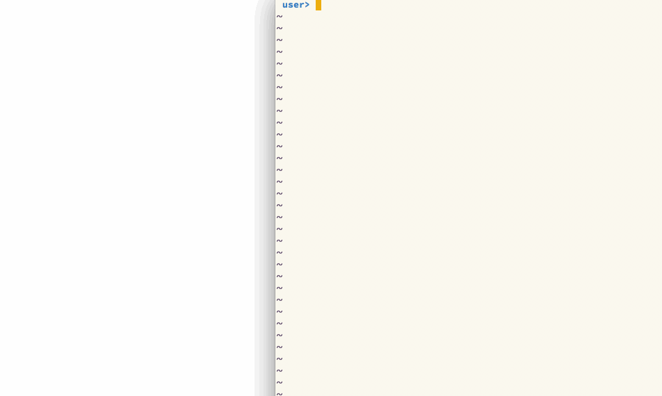

# gadget

A version of `clojure.inspector/inspect-tree` that includes reverse references when inspecting Datomic entities.

## Usage

[](https://clojars.org/gadget)

Alternatively, you can just hotload the dependency in your project (`cljr-hotload-dependency` in Emacs).

```clojure
(require '[gadget.core :as g])
(g/inspect-entity-tree (d/entity (d/db conn) 0))
;; notice that reverse references are included so you can walk the entire graph
```

## Demo



## License

Copyright © 2018 Brian Maddy

Distributed under the Eclipse Public License either version 1.0 or (at
your option) any later version.
